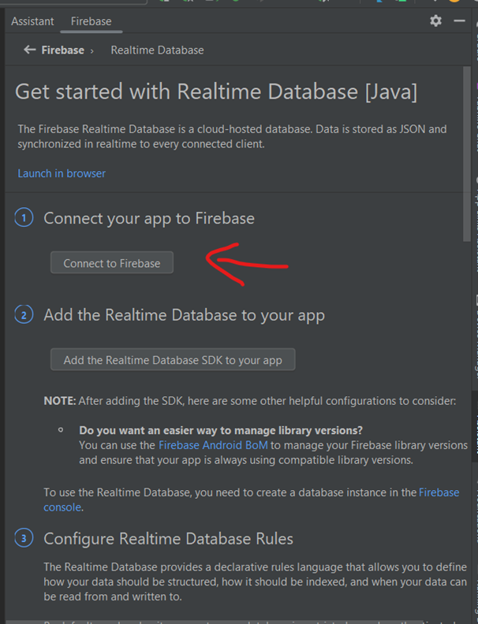
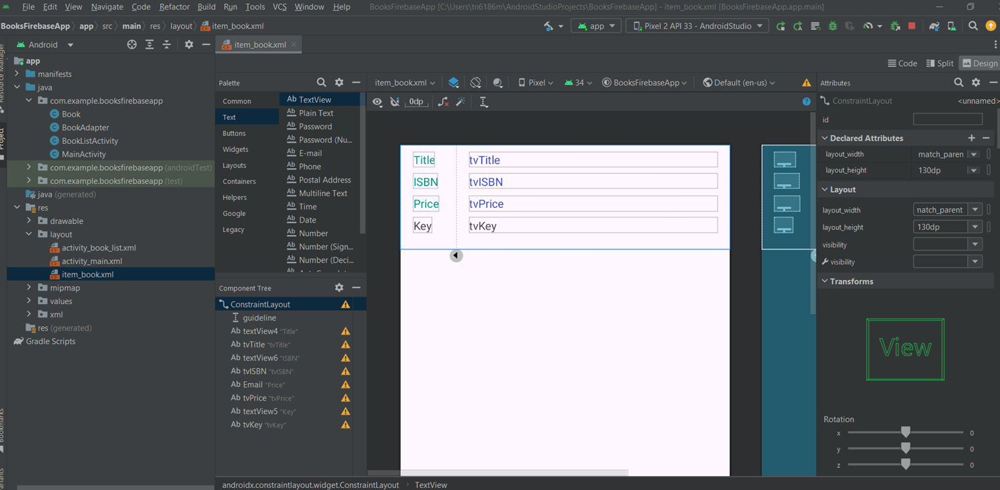

# COMP1786 Lecture 6: Android Communication Firebase

- Mobile and web app development platform
- Includes a number of products including a database
- Stores data on Firebase cloud, but synchronises data across iOS, Android and web services
- The database is gaining popularity as a database for Android apps


Create an Android project named BooksFirebaseapp


Configure Firebase to use Realtime database




Click on `Add Project`


Provide Project Name


Disable Google Analytics


You will be connected to Firebase


Add references to your Android project


Go to https://console.firebase.google.com/
Select your project, then create Realtime database


Choose the location for Realtime database


For now, choose `Test mode`


Create the `MainActivity` layout


```xml
<?xml version="1.0" encoding="utf-8"?>
<androidx.constraintlayout.widget.ConstraintLayout
  xmlns:android="http://schemas.android.com/apk/res/android"
  xmlns:app="http://schemas.android.com/apk/res-auto" xmlns:tools="http://schemas.android.com/tools"
  android:id="@+id/main" android:layout_width="match_parent" android:layout_height="match_parent"
  tools:context=".MainActivity">

  <Button android:id="@+id/add_book" android:layout_width="wrap_content"
    android:layout_height="wrap_content" android:layout_marginStart="28dp"
    android:layout_marginTop="32dp" android:text="Add Book"
    app:layout_constraintStart_toStartOf="parent"
    app:layout_constraintTop_toBottomOf="@+id/priceText" />

  <Button android:id="@+id/view_book" android:layout_width="wrap_content"
    android:layout_height="wrap_content" android:layout_marginTop="32dp"
    android:layout_marginEnd="32dp" android:text="View Book"
    app:layout_constraintEnd_toEndOf="parent"
    app:layout_constraintTop_toBottomOf="@+id/priceText" />

  <EditText android:id="@+id/bookTitleText" android:layout_width="wrap_content"
    android:layout_height="wrap_content" android:layout_marginTop="32dp" android:ems="10"
    android:hint="Enter Book Title" android:inputType="text"
    app:layout_constraintEnd_toEndOf="parent" app:layout_constraintStart_toStartOf="parent"
    app:layout_constraintTop_toTopOf="parent" />

  <EditText android:id="@+id/isbnText" android:layout_width="wrap_content"
    android:layout_height="wrap_content" android:layout_marginTop="32dp" android:ems="10"
    android:hint="Enter ISBN " android:inputType="text" app:layout_constraintEnd_toEndOf="parent"
    app:layout_constraintStart_toStartOf="parent"
    app:layout_constraintTop_toBottomOf="@+id/bookTitleText" />

  <EditText android:id="@+id/priceText" android:layout_width="wrap_content"
    android:layout_height="wrap_content" android:layout_marginTop="32dp" android:ems="10"
    android:hint="Enter Price" android:inputType="text" app:layout_constraintEnd_toEndOf="parent"
    app:layout_constraintStart_toStartOf="parent"
    app:layout_constraintTop_toBottomOf="@+id/isbnText" />

</androidx.constraintlayout.widget.ConstraintLayout>
```

Create Book class to contain info. about a book

```java
public class Book {
  private String bookTitle;
  private String bookISBN;
  private float bookPrice;

  private String key; // hold the unique value generated by Firebase

  // Getter for bookTitle
  public String getBookTitle() {
    return bookTitle;
  }

  // Setter for bookTitle
  public void setBookTitle(String bookTitle) {
    this.bookTitle = bookTitle;
  }

  // Getter for bookISBN
  public String getBookISBN() {
    return bookISBN;
  }

  // Setter for bookISBN
  public void setBookISBN(String bookISBN) {
    this.bookISBN = bookISBN;
  }

  // Getter for bookPrice
  public float getBookPrice() {
    return bookPrice;
  }

  // Setter for bookPrice
  public void setBookPrice(float bookPrice) {
    this.bookPrice = bookPrice;
  }

  // Getter for key
  public String getKey() {
    return key;
  }

  // Setter for key
  public void setKey(String key) {
    this.key = key;
  }
}
```

In the `MainActivity.java`, follow this code below

```java
public class MainActivity extends AppCompatActivity {

  // Remember to change your Database URl here
  private final String DATABASE_URL = "https://comp1786-l6-firebase-default-rtdb.asia-southeast1.firebasedatabase.app/";
  FirebaseDatabase database;
  private EditText etTitle, etISBN, etPrice;
  private Button btnAddBook, btnViewBooks;

  @Override
  protected void onCreate(Bundle savedInstanceState) {
    super.onCreate(savedInstanceState);
    EdgeToEdge.enable(this);
    setContentView(R.layout.activity_main);
    ViewCompat.setOnApplyWindowInsetsListener(findViewById(R.id.main), (v, insets) -> {
      Insets systemBars = insets.getInsets(WindowInsetsCompat.Type.systemBars());
      v.setPadding(systemBars.left, systemBars.top, systemBars.right, systemBars.bottom);
      return insets;
    });

    etTitle = findViewById(R.id.bookTitleText);
    etISBN = findViewById(R.id.isbnText);
    etPrice = findViewById(R.id.priceText);
    btnAddBook = findViewById(R.id.add_book);
    btnViewBooks = findViewById(R.id.view_book);

    // NOTE: Reference to your Realtime database
    database = FirebaseDatabase.getInstance(DATABASE_URL);


    btnAddBook.setOnClickListener(new View.OnClickListener() {
      @Override
      public void onClick(View v) {
        Book b = new Book();
        b.setBookTitle(etTitle.getText().toString());
        b.setBookISBN(etISBN.getText().toString());
        b.setBookPrice(Float.parseFloat(etPrice.getText().toString()));
        addBook(b);
      }
    });

    btnViewBooks.setOnClickListener(new View.OnClickListener() {
      @Override
      public void onClick(View v) {

      }
    });


  }

  private boolean addBook(Book b) {
    try {
      DatabaseReference myRef = database.getReference("books");
      myRef
          .push()
          .setValue(b)
          .addOnSuccessListener(new OnSuccessListener<Void>() {
            @Override
            public void onSuccess(Void unused) {
              Toast.makeText(
                  MainActivity.this,
                  "Book added successfully",
                  Toast.LENGTH_SHORT
              ).show();
            }
          })
          .addOnFailureListener(new OnFailureListener() {
            @Override
            public void onFailure(@NonNull Exception e) {
              // Log the error for debugging
              Log.e("MainActivity", "Error adding book", e);
              Toast.makeText(
                  MainActivity.this,
                  "Error adding book",
                  Toast.LENGTH_SHORT
              ).show();
            }
          });
      return true;
    } catch (Exception e) {
      Log.e("MainActivity", "Error adding book", e);
      return false;
    }
  }
}
```

Test the Add button


Create BookListActivity to display a list of books
The BookListActivity uses RecyclerView


Create an item_book template for RecyclerView



Design BookListActivity to add RecyclerView


Create BookAdapter class


Create BookViewHolder class inside BookAdapter class


Add these attributes to BookListActivity class


Add a function getData() to BookListActivity class


Modify the function onCreate() of BookListActivity class


Click View Books button

